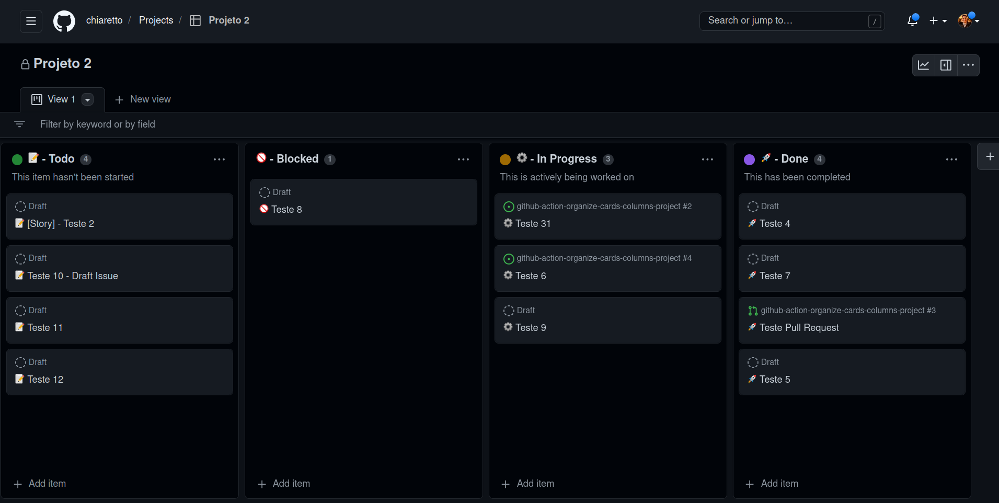

# github-action-organize-cards-columns-project

This action will replicate icon of project columns to cards of column.
The name of columns need use a icon separate by hifen, like "😀 - Column Name", them all card will be title with icon "😀 Name of Card".
When a card change of column, the icon will be updated from this column.

> ps: Single or double quotes are removed from card titles.

### Example Board
https://github.com/users/chiaretto/projects/2/views/1



### Unicode Icons
https://unicode.org/emoji/charts/full-emoji-list.html

## Inputs

### `github-token`

**Required** `${{ secrets.GITHUB_TOKEN }}`

### `allowed-repos`

Optional - Enables update issues from other repositories that relies on the project
`allowed-repos: 'repo1,repo2,repo3'`

## Example usage

```
name: Update Cards Project

on:
  workflow_dispatch:
  schedule:
    - cron:  '*/5 * * * *'

jobs:
  update-cards:
    runs-on: ubuntu-latest
    permissions:
      issues: write
      pull-requests: write
      repository-projects: write
    steps:
      - name: Update Card Project
        uses: chiaretto/github-action-organize-cards-columns-project@master
        with:
          github-token: "${{ secrets.GITHUB_TOKEN }}"
          allowed-repos: "other-repo,another-repo"
```