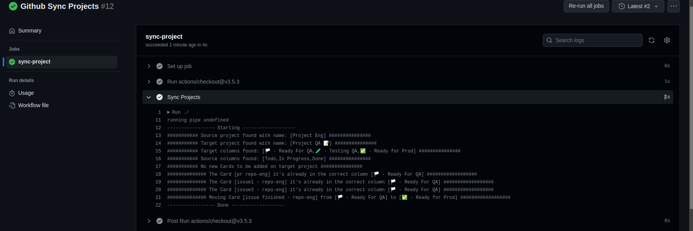

# github-action-sync-projects

This action will replicate the cards from source project to target project and sync columns especificadas.

The card will be create in target project, but not will be created in the source project.

When a card change of column in target project, that will be updated in source project, but unlike does not happen.

After a card move to first sync column of source project, this need be moved only in target project, until the last column, after this them car be moved in the source project.

> ps: This action only sync card of ISSUE and PULL REQUESTS. DRAFT ISSUES will be not sync.

### Example Board Project Source
https://github.com/users/chiaretto/projects/2/views/1


### Example Board Project Target
https://github.com/users/chiaretto/projects/2/views/1


### Example Board Project Source Workflow
https://github.com/users/chiaretto/projects/2/views/1



## Inputs

### `github-token`: `${{ secrets.GITHUB_TOKEN }}`
**Required** 
### `repo-source`: `${{ github.repository  }}`
**Required**
### `repo-target`: `owener/repo`
**Required** 
### `project-source`: `Project Source Name`
**Required**
### `project-target`: `Project Target Name`
**Required**
### `columns-source`: `ColumnSource1, ColumnSource2, ColumnSource3`
**Required**
### `columns-target`: `ColumnTarget1, ColumnTarget2, ColumnTarget3`
**Required**

## Example usage

```
name: Github Sync Projects

on:
  workflow_dispatch:
    inputs:
      debug:
        type: choice
        options:
          - true
          - false

jobs:
  sync-project:
    runs-on: ubuntu-latest
    permissions:
      issues: write
      pull-requests: write
      repository-projects: write
    steps:
      - name: Sync Projects
        uses: chiaretto/github-action-sync-projects
        with:
          github-token: "${{ secrets.ACCESS_TOKEN }}"
          repo-source: "${{ github.repository }}"
          repo-target: "owner/repo-name"
          project-source: "Project Eng"
          project-target: "Project QA 📝"
          columns-source: "🏳 - Ready For QA,🧪 - Testing QA,✅ - Ready for Prod"
          columns-target: "Todo,In Progress,Done"
          debug: "${{ github.event.inputs.debug }}"
```